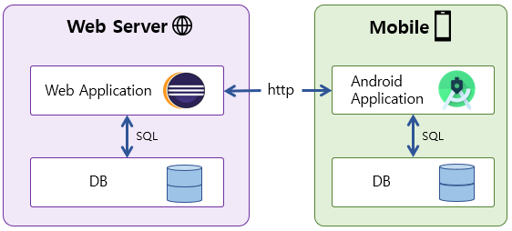
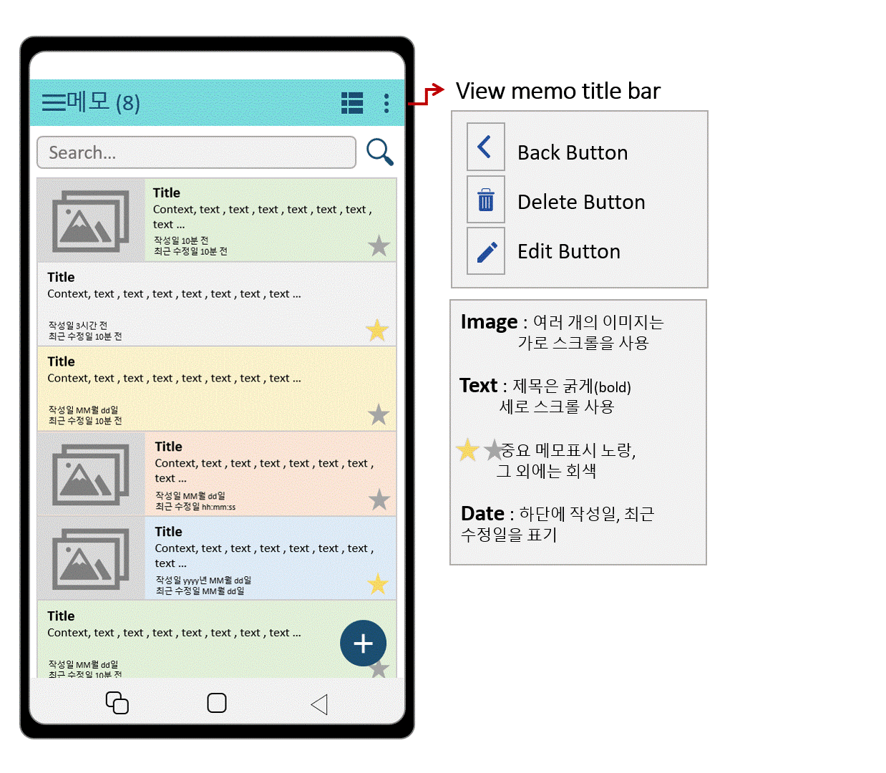

# Memo Application Project

> 개인 안드로이드 어플리케이션 프로젝트
>
> ### 목차
>
> 1. [기획내용](#1-기획-내용)
> 2. [시스템 구성도](#2-시스템-구성도)
> 3. [구현 기술](#3-구현-기술)
> 4. [구현 목표](#4-구현-목표)
> 5. [구현결과](#5-구현-결과)

## 1. 기획 내용

* 기획 의도 : Android Studio를 공부하고 배운 내용을 정리하고 사용했던 기능들을 총합, 응용한 어플리케이션을 제작해보고자 했다. 또한, 지속적으로 사용 가능하고 실제 배포할만한 완성도있는 어플리케이션을 제작해보고자 하였다.

* Application concept : 

## 2. 시스템 구성도

* 모바일의 저장소와 웹에서의 저장소를 구별해서 메모를 저장한다.

## 3. 구현 기술

* Application : Android Studio

  * Language : Java, XML, SQL, JSON

  * 환경 : 안드로이드 SDK version

    > minSdkVersion 24
    > compileSdkVersion 30
    > buildToolsVersion "30.0.2"
    
  * DB : SQL Lite

* Web Server : Eclipse

  * Language : Java, CSS, HTML, JavaScript, JSON, SQL
  * 환경 : Java Spring, jdk1.8.0, Apache Tomcat v9.0
  * DB : OracleDB

## 4. 구현 목표

* 구현 목표 화면과 이에 대한 설명, 시나리오 등

### Application

#### 1. Splash Activity

image

* 어플리케이션을 켰을 때 가장 먼저 보이는 화면으로 메인 화면 구성 요소를 띄우기 위한 대기화면이다.
* 앱을 켜고 기존의 앱 설정과 네트워크를 통해 데이터를 받아올때 사용될 예정이다.

#### 2. Main Activity

* View방식에 따른 화면 모양
  * 해당 화면은 메모앱을 켜고 가장 먼저 보이는 화면과 기본 UI구성의 화면으로 사용자에게 메모의 목록, 소량의 내용을 보여주도록 구성된다.
  * 사용자가 보기 편한 뷰 방식으로 제공되기 위해 리스트/대시보드 두가지 형식으로 구성한다.

- Menu

#### 3. View Memo Activity

* View Memo 사진유무에 따른 이미지

#### 4. Edit Memo Activity

설명+image

#### 5. DB ERD

### Web

1. DB ERD
2. 웹화면

## 5. 구현 결과

